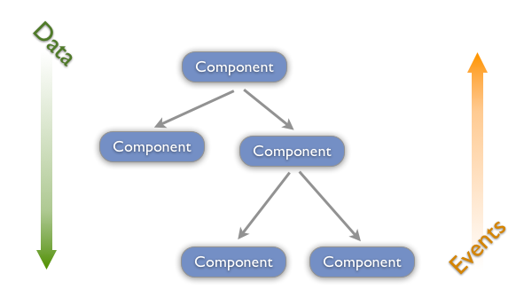

# [译文]context api可以取代redux?

React 16.3 正式推出了 [context api](https://reactjs.org/docs/context.html), 被认为是"redux末日"的官方share data api，究竟真实情况是什么样？到底是不是真的可以取代react社区长期以来依赖的redux组件(redux开发者Mark Ericson表示没这回事！)。下文发表一下个人的看法以及context api正确的使用方式。

## redux和 context api 解决了什么问题？

> “Props down Event up” Uni-direction data flow

用过一段时间React都会知道一个重要的概念：**单向数据流**，React App 遵循数据从上往下单一传递，如果需要子组件需要去改变父组件或者兄弟组件，只能通过event callback或者dispatch action去通知组件改变状态，父组件render之后再通过props把更新值传给子组件完成视图的更新。

当一个state变化影响多个组件更新视图时候，这个state就应该上升存到共有的父组件中，如果只有父子间1~2层之间的传递，那么state与callback通过props传递还是比较好处理的。但是试想一下如果中间还有很多wrapper，间隔着5~6层甚至更多的组件，props还这样一层层传下去的话，很容易造成不可预知的bug，并且让代码难以维护。

要解决上述提及到的这种"Props drilling"问题，通过一个集中的Data Store，把需要共享或更新共同状态的组件用HOC来连接Data Store,这样做我们不但遵从数据单一流动性，并且可以让组件快速获取数据，不用再一层层去传递。

这种架构就是“flux”，与当年的react一同推出。由于FB没有提供官方的组件，只是给了相关概念，一时间涌现了：fluxxor、reflux、redux…，最后redux杀出重围，成为了React社区最推荐的flux实践。


## redux早已经普及了，为什么还要用context api？

我不觉得React推出context api是为了干掉redux，充其量也只能说是补上了一块长期或缺功能，让React不需要依赖第三方flux组件情况下可以解决props drilling这个痛点。但是翻转来说，既然React组件已经有了基础的state/setState,可以做state management结合life cycle，何必还要依赖第三方组件呢？

redux并不是十全十美的，虽然可以通过combineReducers把reducers按模块拆分，可以做separation of concerns，但是因为整个应用实际上还是共享一个单一的Data Store，在state/action命名时候都要小心冲突。

context api是简化版的redux，他没有redux强大生态体系，结合各自中间件例如thunk或saga，做data fetching或处理side effect，不过单单想存一些share data避免props drilling的问题却绰绰有余。

...

## 正确使用姿势

下面会用一个简单的 Counter计数器例子来说明如果使用 context

首先需要新建一个 context.js, 用 React.createContext 实例化一个context，并输出Provider, Consumer

```
import React from 'react'

const ctx = React.createContext()

export const {Provider, Consumer} = ctx

export const withCounter = Component => props => <Consumer>{value => <Component {...props} counter={value} />}</Consumer>

export default ctx
```

发现一个比较好的做法是写一个HOC，类似redux的connect，又或者是react-router中的withRouter。上面例子来说，用withCounter(Foo)包裹，在Foo组件中可以通过props.counter 获得counter object的 state/methods

用HOC好处在于任何需要接上context的组件，只要import withCounter，封装好export就可以，非常省心。

HOC中我们看到context的Consumer包裹了组件，这Consumer有个Code signature 如下：

```
<Consumer>
{value => <Component counter={value} />}
</Consumer>
```

这里类似redux中处理mapStateToProps的过程，value被当作props传入被包裹的组件，key的部分可以任意命名，因为withCounter就是用counter作为key，至于value是从哪里来，下文会有解释。

接下来我们新建一个Counter.js, 这个我们当作Counter顶级父组件，所有Counter相关的state/methods都会存在这个父组件之中。

```
import React from 'react'
import { Provider } from './context'

class Counter extends React.Component {

  constructor (props) {
    super(props)
    this.state = {
      counter: {
        value: 0,
        inc: this.inc,
        dec: this.dec
      }
    }
  }

  inc = () => {
    this.setState(({counter})=>({
      counter: {
      	...counter,
      	value: counter.value+1
      }
    }))
  } 

  dec = () => {
    this.setState(({counter})=>({
      counter: {
      	...counter,
      	value: counter.value-1
      }
    }))
  }
  
  render () {
    return (
      <Provider value={this.state.counter}>
        <CounterCard/>
      </Provider>
    )
  }

}

export default Counter
```

上面代码中，state里定义了counter的初始默认值，其包含了计算器当前值value，还有一个递增(inc)和递减(dec)的方法。

```
this.state = { 
  counter: { 
    value: 0,
    inc: this.inc,
    dec: this.dec 
  }
}
```

递增递减部分主要是用setState去更新state.counter.value，值得注意的是，在render方法中出现了context Provider。

```
render () {
  return (
    <Provider value={this.state.counter}>
      <CounterCard/>
    </Provider>    
  )
}
```

回顾一下上面Consumer包裹的组件，其中的value就是用Provider传过来的。当Provider中的value改变时候，所有Provider包裹下的源自同一个context的Consumer都会接收到更新后的value。

如果你读过redux源码，其实会发现redux也是类似这样。不同在于context api没有dispatch这样的概念，所以更新状态的methods也通过value一起传给Consumer，让子组件也可以去更新状态。

接下来继续处理加法按钮
```
import React from 'react'
import { withCounter } from './context'

const IncBtn = ({ counter }) => <button type='button' className='btn btn-primary btn-block' onClick={counter.inc}>+</button>
const CounterIncBtn = withCounter(IncBtn)

export default CounterIncBtn
```
上面代码创建了一个 无状态组件IncBtn，从props中获得counter之后，将button onClick帮手counter.inc 方法，然后从context.js里面 import withCounter 这个HOC来包裹IncBtn。这样处理后IncBtn就可以接收到counter这个props。

减法按钮也是同理，只是onClick改成触发counter.dec。在这里就不贴代码了。

下一个组件
```
import React from 'react'
import { withCounter } from './context'

const Display = ({ counter }) => <h5 className="card-title text-center">{counter.value}</h5>
const CounterDisplay = withCounter(Display)

export default CounterDisplay
```
我们再建立一个无状态组件Display，使用withCounter包裹，让他可以接收到counter这个props，然后再把counter.value展示出来。


最后一个组件CounterCard只是单纯定义Layout结构。
```
import React from 'react'
import CounterDisplay from './CounterDisplay'
import CounterIncBtn from './CounterIncBtn'
import CounterDecBtn from './CounterDecBtn'

const CounterCard = () => (
  <div className='Counter card m-3'>
    <div className='card-body'>
      <CounterDisplay/>
      <div className='row'>
        <div className='col'><CounterDecBtn /></div>
        <div className='col'><CounterIncBtn /></div>
      </div>
    </div>
  </div>
)

export default CounterCard
```

整个组件结构Counter -> CounterCard -> CounterDisplay & CounterButton，但是我们已经不需要把props和callback method一起往下传递两层，因为都已经使用withCounter HOC链接好了。

以下是整个项目的React代码
```
// context.js
const {Provider, Consumer} = React.createContext()

const withCounter = Component => props => <Consumer>{value => <Component {...props} counter={value} />}</Consumer>

// CounterIncBtn.js
const IncBtn = ({ counter }) => <button type='button' className='btn btn-primary btn-block' onClick={counter.inc}>+</button>
const CounterIncBtn = withCounter(IncBtn)

// CounterDecBtn.j
const DecBtn = ({ counter }) => <button type='button' className='btn btn-secondary btn-block' onClick={counter.dec}>-</button>
const CounterDecBtn = withCounter(DecBtn)

// CounterDisplay
const Display = ({ counter }) => <h5 className="card-title text-center">{counter.value}</h5>
const CounterDisplay = withCounter(Display)

// CounterCard
const CounterCard = () => (
	<div className='Counter card m-3'>
    <div className='card-body'>
      <CounterDisplay/>
      <div className='row'>
        <div className='col'><CounterDecBtn /></div>
        <div className='col'><CounterIncBtn /></div>
      </div>
    </div>
  </div>
)


class Counter extends React.Component {

	constructor (props) {
  	super(props)
    this.state = {
    	counter: {
    		value: 0,
      	inc: this.inc,
      	dec: this.dec
    	}
    }
  }

	inc = () => {
  	this.setState(({counter})=>({
    	counter: {
      	...counter,
      	value: counter.value+1
      }
    }))
  } 

	dec = () => {
  	this.setState(({counter})=>({
			counter: {
      	...counter,
      	value: counter.value-1
      }
    }))
  }
  
  render () {
  	return (
   		<Provider value={this.state.counter}>
        <CounterCard/>
      </Provider>
		)
  }

}


ReactDOM.render(<Counter />, document.querySelector("#app"))
```

看到这里，有没发现其实context api用起来就像一个简化版的redux？如果只是做状态分享的话，其实差异不大~

## 结语

### 我们老项目应该全面改用Context吗？

显然不，redux用得好好的，不用浪费时间去改成Context，千万别自找麻烦，Context只是个可选的替代方案。

### 新项目继续用Redux吗？

这个开放问题，大家在讨论区一起讨论吧~