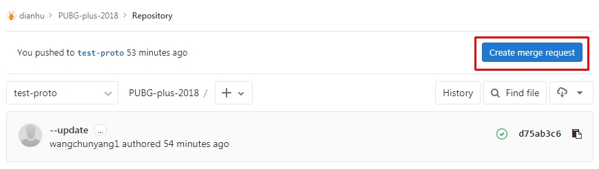
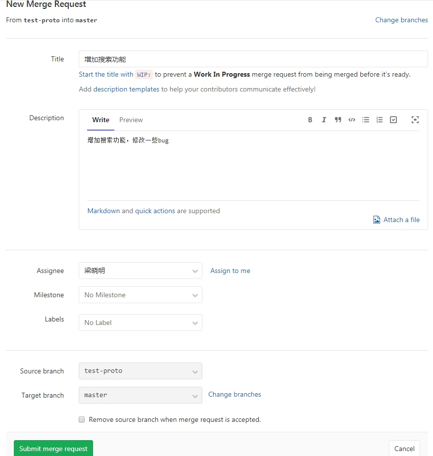
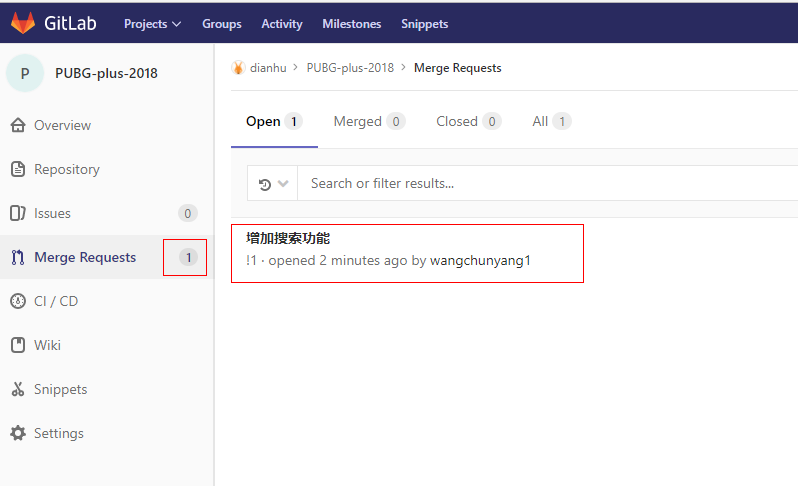
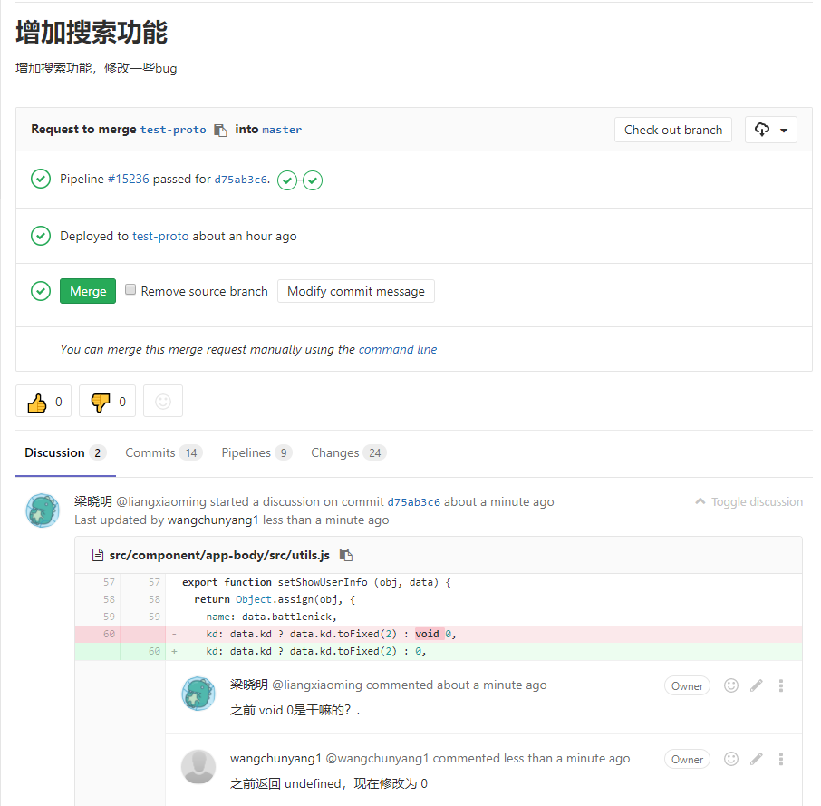
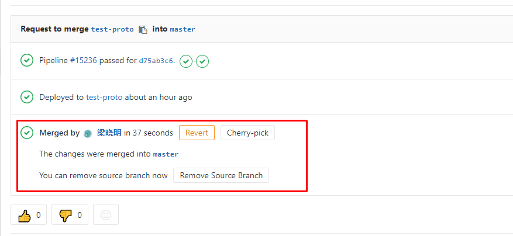
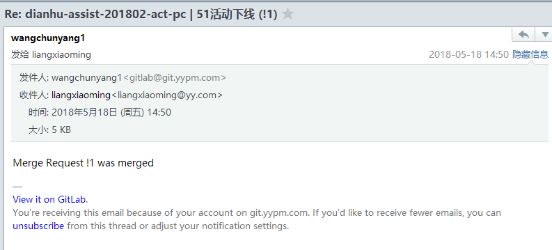

# codereview

找问题会是CodeReview活动启动的初衷，但越到后期它更大的意义将演变成工程师交流土壤的培育和人员成长的促进

## Create merge request

发布生产环境，合并代码到master时候，需要走merge request流程

小组成员A在推送自己分支到服务器之后，可以在gitlab项目仓库点击 Create merge request 按钮发起MR请求。

在 New Merge Request的表单界面中，需要简要填写分支中提交代码的作用说明。
Assignee可以是有发布master权限的同事，优先as给熟悉当前项目代码的，有闲余时间的。
Milestone及label可以在立项排期时候，与开发小组成员确商好，也可以为空。

被Assignee的小组成员会收到邮件通知

小组成员B再收到Merge Requests之后，会在gitlab收到消息提示。可在Merge Requests列表之后，点开MR清单查看详情。

在详情之中，能看到当前GIT节点的CI状态，提交时间，以及code diff。在code diff之中每一行代码都可以添加评论。

在code review后，小组成员B可以点击Merge按钮，把代码合并到master，完成整个code review流程。

merge完成后，发起MR请求的人会收到邮件通知

## 总结

开发编写的Code, 要想让别人更容易读得懂，一定也需要review才有可能达到目的。

code review 是代码发布到生产的最后一道防线。旁观者清，多一个忍看也许更能发现代码中存在的bug。
code review 可以让团队成员更大范围熟悉项目代码，了解到非自身开发的模块。增加小组成员之间的工作交流与学习氛围。

需要注意：

code review不是针对个人，而是为了减少线上问题，提高团队协作能力。

code review本身可以促进开发者代码规范意识，也可以让审查者领悟到其他小伙伴的开发思路

code review可以选择设计惩罚机制，但是必须是审查者和被审查者都要一起对结果负责

## 参考文章

[大家的公司code review都是怎么做的？遇到过什么问题么？](https://blog.csdn.net/MessiGodLike/article/details/78422833)